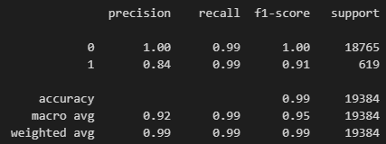

# Credit Risk Analysis Report

## Analysis Overview

The purpose of this analysis is to use machine learning to determine how well we can predict if a person is healthy (low-risk) or unhealthy (high-risk) if they were to be given a loan. Essentially, we're predicting the creditworthiness of a potential borrower. The dataset used is of historical lending activity from a peer-to-peer lending services company. The variables I was trying to predict with these models were were how many loans were predicted to be low-risk and high-risk, vs how many are actually low-risk and high-risk. This data was displayed using a confusion matrix. I also wanted to predict how well we can determine if a person is low or high risk when being given a loan, using accuracy scores and recall. 

## Results 

### Machine Learning Model 1
* Balanced Accuracy Score

* Confusion Matrix

* Classification Report

The balanced accuracy score of the first model is approximately 95%. However, this model is better at predicting low-risk loans than it is high-risk. As the recall for healthy loans is 0.99, whereas the recall for unhealthy loans is 0.91. In the confusion matrix we see there were 56 false positives, and 102 false negatives.

### Machine Learning Model 2

* Balanced Accuracy Score

* Confusion Matrix

* Classification Report

The balanced accuracy score of this second model is approximately 99%. This is also true for the recall, which is 0.99 for both low and high-risk loans. This model predicts high-risk loans much better than the first. In the confusion matrix we see there were 4 false positives, and 116 false negatives.

## Summary

Based on the balanced accuracy score and recall, the second model is a best fit for predicting high-risk loans, while the first and second model can predict low-risk loans at the same calibur. While the confusion matrix predicts slightly more false negatives in the second model, it predicts a considerable amount less of false positives. Therefore, I would recommend using Model 2, the logistic regression model fitted with oversampled data.