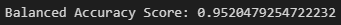
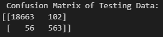
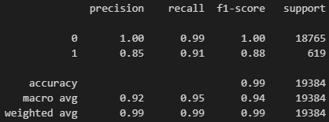
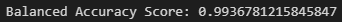
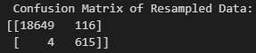

# credit-risk-classification
## Module 20 Challenge
For this challenge I used various techniques to train and evaluate a model based on loan risk. I used a dataset of historical lending activity from a peer-to-peer lending services company to build a model that can identify the creditworthiness of borrowers.

## Split the Data into Training and Testing Sets
I created a y label from the "loan_status" column, then created the features X label with the remaining columns in the DataFrame. 

## Create a Logistic Regression Model with the Original Data
Using my knowledge of logistic regression I fit the logistic regression model by using the training data. I then saved the predictions for the testing data labels by using the testing feature data and the fitted model. 

I then evaluated the model's preformance by Calculating the accuracy score of the model, generating a confusion matrix and printing the classification report as seen below.

## Predict a Logistic Regression Model with Resampled Training Data
For this part I used RandomOverSampler to resample the training data to reevaluate the first model. I then used the LogisticRegression and resampled data to fit the model and make predictions. 

I then evaluated the model's preformance by Calculating the accuracy score of the model, generating a confusion matrix and printing the classification report as seen below.

## Write a Credit Risk Analysis Report
I was tasked to write a brief report that includes a summary and analysis of the performance of the machine learning models that I used in this assignment in the form of a ReadMe.md. This can be found [here](Credit_Risk/Risk_Analysis_Report.md).

## References
Data for this dataset was generated by edX Boot Camps LLC, and is intended for educational purposes only.